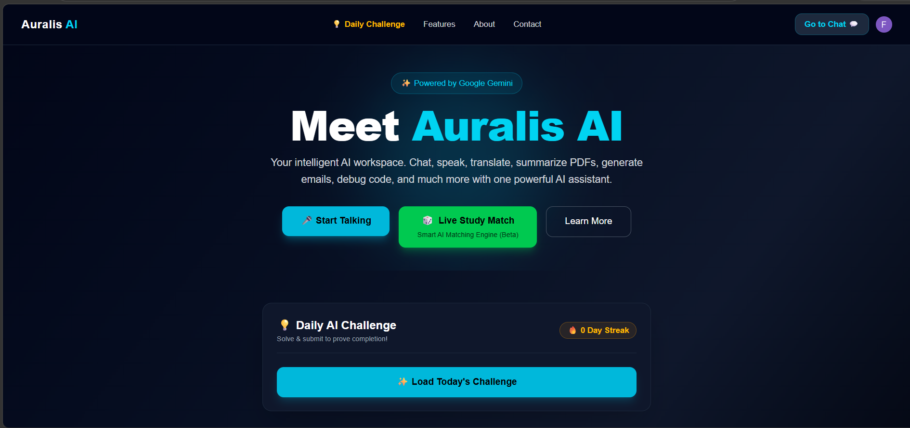
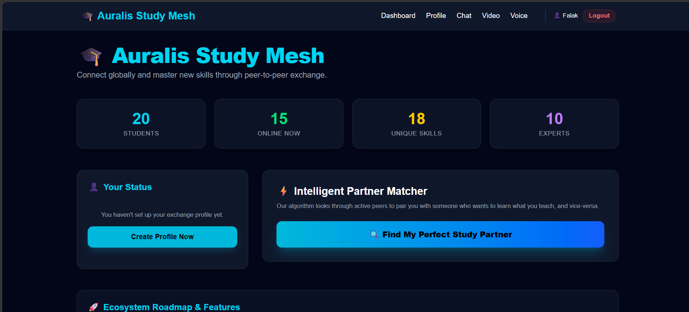
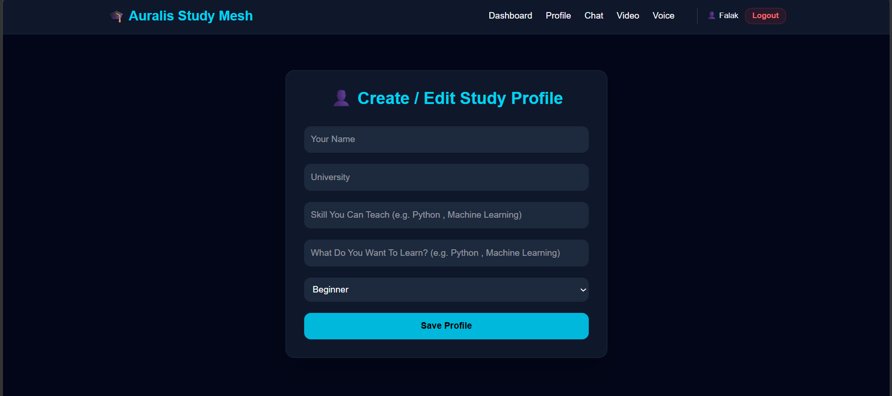
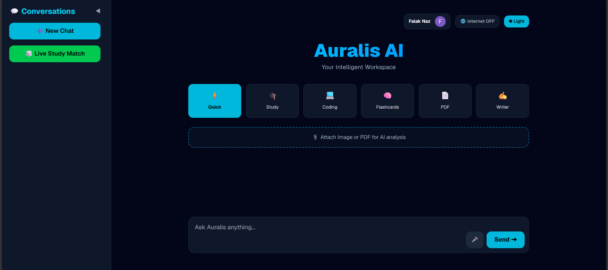

# 🎓 Auralis AI – Intelligent AI Workspace

> An all-in-one AI-powered learning and productivity platform built with **Next.js**, **Gemini AI**, and modern web technologies.


---

# 📖 About the Project

**Auralis AI** is an intelligent AI workspace designed to help students, learners, and professionals complete everyday academic and productivity tasks from one platform.

Instead of using multiple websites for chatting with AI, finding study partners, translating text, summarizing PDFs, generating emails, debugging code, and learning collaboratively, Auralis AI brings everything together into a single modern application.

The platform focuses on improving learning, collaboration, and productivity using Artificial Intelligence.

---

# 🚀 Problem It Solves

Many students struggle because they need different platforms for:

- AI Chat
- Study Partner Search
- Voice Collaboration
- Video Study Sessions
- AI Notes
- AI Flashcards
- Code Debugging
- Translation
- Email Writing

This wastes time and makes studying less organized.

**Auralis AI solves this by providing one intelligent workspace where students can study, collaborate, and learn together.**

---

# 👥 Target Users

- University Students
- School Students
- Online Learners
- Developers
- Professionals
- Study Groups

---

# 🌐 Live Demo

## 🔗 Live Website

**https://auralis-ai-delta.vercel.app/**

---

🏗️ Architecture

The basic request flow is:

                    ┌─────────────────────┐
                    │      User           │
                    │  Question / File    │
                    └──────────┬──────────┘
                               │
                               ▼
                    ┌─────────────────────┐
                    │   Auralis AI UI     │
                    │      Next.js        │
                    └──────────┬──────────┘
                               │
                               ▼
                    ┌─────────────────────┐
                    │ /api/chat           │
                    │ Next.js API Route   │
                    └──────────┬──────────┘
                               │
                    ┌──────────┴──────────┐
                    │                     │
                    ▼                     ▼
             ┌─────────────┐      ┌──────────────┐
             │ Task Mode   │      │ Google Search│
             │ Prompt      │      │ Grounding    │
             └──────┬──────┘      └──────┬───────┘
                    │                     │
                    └──────────┬──────────┘
                               ▼
                    ┌─────────────────────┐
                    │    Google Gemini    │
                    │   Generative Model  │
                    └──────────┬──────────┘
                               │
                               ▼
                    ┌─────────────────────┐
                    │ AI Response         │
                    │ Markdown / Answer    │
                    └─────────────────────┘
---

# ✨ Features

## 🤖 AI Assistant

- AI Chat powered by Google Gemini
- Code Debugging
- Email Generation
- Translation
- Text Summarization
- AI Writing Assistance

---

## 🎓 Study Mesh

A dedicated collaboration platform for students(Proper Functionality Coming Soon).

### Features

- Create Study Profile
- Skill Sharing
- Find Study Partner
- Demo Student Matching
- Dashboard Statistics
- Modern UI

---

## 👤 Profile Management

- Create Profile
- Skill Selection
- Learning Goals
- Level Selection
- Input Validation
- Local Storage Support

---

## 💬 Chat

Dedicated chat interface for future real-time communication.

---

## 🎥 Video Call

Dedicated video call page.

> **Currently UI Ready**
>
> Real-time video calling functionality will be implemented in future updates.

---

## 🎤 Voice Room

Dedicated voice room page.

> **Currently UI Ready**
>
> Real-time voice communication will be implemented in future updates.

---

## 🎲 Live Study Match

Allows users to access the Live Study Match module.

> ⚠ **Proper functionality is currently under development and will be available in a future update.**

---

## 📚 Flashcards

UI prepared for AI-generated flashcards.

---

## 📝 AI Notes

Future support for automatic note generation.

---

# 🤖 AI Feature

## Google Gemini AI

The application uses **Google Gemini** as its primary Large Language Model.

### Capabilities

- Answer questions
- Explain concepts
- Debug code
- Generate emails
- Summarize text
- Translate languages
- Assist with learning

---

## System Prompt

The AI assistant is instructed to:

- Provide accurate answers
- Explain concepts step-by-step
- Help students learn instead of only giving answers
- Generate clean and readable code
- Maintain a friendly and professional tone
- Refuse unsafe or harmful requests

---

# 🛠 Technologies Used

## Frontend

- Next.js 16
- React
- Tailwind CSS
- JavaScript

---

## Authentication

- Clerk Authentication

---

## AI

- Google Gemini API

---

## Storage

- Browser Local Storage

---

## Deployment

- Vercel

---

## Development Tools

- Visual Studio Code
- Git
- GitHub
- npm

---

# 📸 Screenshots

## 🏠 Home Page



---

## 🎓 Study Mesh Dashboard



---

## 👤 Create Profile



---

## 🤖 AI Chat



---

# ⚙ Installation

Clone the repository

```bash
git clone https://github.com/FALAKNAZMALICK/auralis-ai.git
```

Move into the project

```bash
cd auralis-ai
```

Install dependencies

```bash
npm install
```

Create environment file

```env
GEMINI_API_KEY=AQ>******************************
NEXT_PUBLIC_CLERK_PUBLISHABLE_KEY=pk_te*********************************************
CLERK_SECRET_KEY=sk_te******************************************
```

Run the development server

```bash
npm run dev
```

Open

```
http://localhost:3000
```

---

# 📂 Project Structure

```
app/
│
├── api/
├── chat/
├── match/
├── study-match/
│   ├── profile/
│   ├── chat/
│   ├── video/
│   ├── voice/
│   ├── leaderboard/
│   ├── flashcards/
│   └── page.js
│
├── components/
├── data/
└── layout.js
```

---

🧪 V2 Evaluation

The V2 evaluation was designed to test whether Auralis AI can successfully handle common user tasks across its different modes.

Evaluation Method

Ten representative prompts were tested across:

General question answering
Study assistance
Coding
Translation
Writing
Flashcard generation
Document/file analysis
Web-grounded questions
Conversation context
Safety/limitation handling

A test was marked Pass when the response completed the requested task in a usable form without a major failure.

Evaluation Results

Important: Replace the table below with the actual results from your V2 testing. Do not submit invented numbers.

#	Test	Expected Result	Result
1	General question	Relevant answer	PASS / FAIL
2	Study explanation	Simple explanation + example	PASS / FAIL
3	Coding/debugging	Identify and explain error	PASS / FAIL
4	Translation	Accurate translation	PASS / FAIL
5	Writing	Professional generated text	PASS / FAIL
6	Flashcards	Flashcards + quiz	PASS / FAIL
7	File analysis	Useful file-based response	PASS / FAIL
8	Web-grounded question	Current information when grounding enabled	PASS / FAIL
9	Conversation context	Uses previous messages appropriately	PASS / FAIL
10	Limitation/safety test	Does not confidently provide unsafe/unreliable assistance	PASS / FAIL
V2 Score
Pass rate = Passed tests / 10 × 100

Final V2 pass rate: [INSERT ACTUAL RESULT]%

Evaluation Notes

The evaluation focuses on practical task completion rather than claiming that every AI-generated answer is factually perfect. Because Auralis AI relies on a generative language model, output quality can vary depending on the prompt and model response.

⚠️ Limitations

Auralis AI has several known limitations.

1. AI-generated information may be incorrect

Gemini can produce inaccurate or incomplete information. Users should verify important academic, technical, legal, medical, or financial information.

2. Web grounding is optional

Current web information is not automatically guaranteed for every request. Users should enable the available web-grounding functionality when up-to-date information is required.

3. AI output depends on the prompt

Ambiguous or poorly specified questions may result in less useful responses.

4. Some collaboration features are still under development

The project contains UI for future collaboration features such as real-time communication, voice rooms, video calls, study matching, AI notes, and AI flashcards. Some of these features are not yet fully implemented.

5. API availability and limits

The AI functionality depends on the availability and limits of the configured Gemini API.

6. Safety behavior is not guaranteed

Auralis AI should not be treated as a fully reliable safety filter. The model may refuse some harmful requests, but application-level safety enforcement should be strengthened in future versions.

---

# 🔮 Future Improvements

- Real-time Chat
- Live Voice Rooms
- Real Video Calling
- AI Flashcards
- AI Notes Generator
- AI Skill Matching
- Firebase Database
- Notifications
- Friend Requests
- Live Presence
- Real Leaderboard
- XP Rewards

---

# 👨‍💻 Developed By

**Falak Naz**

---

# 📄 License

This project is developed for educational purposes.

MIT License.

---

# ⭐ Thank You

Thank you for exploring **Auralis AI**.

If you like this project, consider giving it a ⭐ on GitHub.
